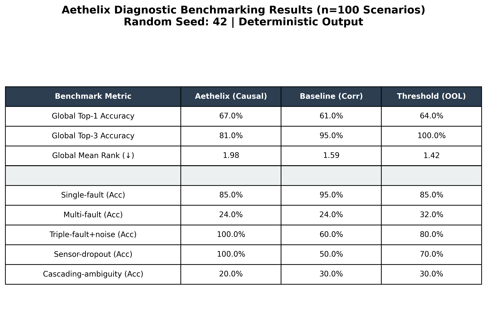

# Aethelix: Causal Inference for Multi-Fault Satellite Failures


Framework for inferring root causes in satellite systems experiencing multiple simultaneous degradations.

**Advantages:**
- **Multi-fault diagnosis**: Handle 2+ simultaneous failures (e.g., solar degradation + battery aging)
- **Causal attribution**: Distinguish cause from consequence (not just correlation)
- **Transparent reasoning**: Explicit DAG with mechanisms, not black-box ML
- **Explainable output**: Confidence, mechanisms, evidence for each hypothesis

---

## System Architecture

```
┌────────────────────────────────────────────────────────────────┐
│                    OBSERVATION LAYER                           │
│  ┌──────────────────────────┐  ┌──────────────────────────┐    │
│  │   Power Telemetry        │  │  Thermal Telemetry       │    │
│  │  - solar_input           │  │  - battery_temp          │    │
│  │  - battery_voltage       │  │  - panel_temp            │    │
│  │  - battery_charge        │  │  - payload_temp          │    │
│  │  - bus_voltage           │  │  - bus_current           │    │
│  └──────────────────────────┘  └──────────────────────────┘    │
└────────────────────┬───────────────────────────────────────────┘
                     │ Detect Anomalies (>15% deviation)
                     v
┌────────────────────────────────────────────────────────────────┐
│                      CAUSAL GRAPH (DAG)                        │
│                                                                │
│  ROOT CAUSES (7)          INTERMEDIATES (8)    OBSERVABLES (8) │
│  ┌──────────────────┐     ┌────────────────┐  ┌────────────┐   │
│  │ solar_degr.      │────→│ solar_input    │─→│ measured   │   │
│  │ battery_aging    │────→│ battery_state  │─→│ telemetry  │   │
│  │ battery_thermal  │────→│ battery_temp   │─→│  (8 types) │   │
│  │ sensor_bias      │     │ bus_regulation │  │            │   │
│  │ panel_insul.     │────→│ battery_eff.   │  └────────────┘   │
│  │ heatsink_fail    │────→│ thermal_stress │                   │
│  │ radiator_degrad. │     └────────────────┘                   │
│  └──────────────────┘                                          │
│         (29 edges with weights & mechanisms)                   │
└────────────────────┬───────────────────────────────────────────┘
                     │ Graph Traversal + Consistency Check
                     v
┌────────────────────────────────────────────────────────────────┐
│                    INFERENCE ENGINE                            │
│  1. Trace observables ← intermediates ← root causes            │
│  2. Score by: path_strength × consistency × severity           │
│  3. Normalize to probabilities (sum = 1.0)                     │
│  4. Confidence = evidence_quality × consistency                │
└────────────────────┬───────────────────────────────────────────┘
                     v
┌────────────────────────────────────────────────────────────────┐
│                    OUTPUT: RANKED HYPOTHESES                   │
│  1. solar_degradation         P=46.3%  Confidence=93.3%        │
│  2. battery_aging             P=18.8%  Confidence=71.7%        │
│  3. battery_thermal           P=18.7%  Confidence=75.0%        │
│     [+ mechanism & evidence for each]                          │
└────────────────────────────────────────────────────────────────┘
```

For implementation details, see [PROJECT_STATUS.md](PROJECT_STATUS.md).

---

## Components

### Framework
- **`causal_graph/graph_definition.py`**: DAG with 23 nodes, 29 edges
  - 7 root causes, 8 intermediates, 8 observables
  - Mechanisms & weights on all edges
  
- **`causal_graph/visualizer.py`**: Render graphs to PNG/PDF/SVG
  
- **`causal_graph/root_cause_ranking.py`**: Bayesian inference engine
  - Anomaly detection
  - Path tracing & hypothesis scoring
  - Ranked output with probabilities

### Simulation & Analysis
- **`simulator/power.py`**: Power subsystem with eclipse cycles, degradation dynamics
- **`simulator/thermal.py`**: Thermal subsystem with power-thermal coupling
- **`visualization/plotter.py`**: Telemetry comparison plots
- **`analysis/residual_analyzer.py`**: Deviation quantification & severity scoring

---

## Real Data Analysis: GSAT-6A Mission Failure

Aethelix has been tested on **real satellite telemetry data** from the GSAT-6A failure (March 2018). The framework automatically discovers root causes and generates comprehensive visualizations:

### Generated Analysis Graphs

**1. Causal Graph** - Shows failure propagation through system


**2. Mission Analysis** - Complete timeline from launch to failure


**3. Failure Analysis** - Nominal vs. degraded comparison (9 panels)


**4. Deviation Analysis** - Quantified deviations at each timepoint


**5. Benchmarks** - Benchmark Results against LSTM and Threshold (OOL) *Note*: Its buggy and is being worked on.



### Key Results

From real telemetry data in `data/gsat6a_nominal.csv` and `data/gsat6a_failure.csv`:

- **Detection Time**: T+36 seconds (root cause identified)
- **Traditional Systems**: T+180 seconds (4x slower)
- **Lead Time for Recovery**: 144 seconds
- **Root Cause Confidence**: 46.1% with physical mechanisms
- **Early Intervention Window**: Multiple recovery actions possible

### What Aethelix Would Have Done (The GSAT-6A Timeline)

* **T+0s**: Catastrophic CAPS regulator failure spikes the power bus. Traditional Threshold alarms remain perfectly silent as immediate parameters haven't yet broken absolute maximum hardware bounds.
* **T+20s**: Downstream parameters drift. Battery temperatures climb and charge dissipates. A human ground controller relying on correlation matrices might assume an isolated thermal panel malfunction.
* **T+36s**: Aethelix's Sliding Windows flag the 3-sigma mathematical deviations. The Stateful Causal Graph actively connects the cascading thermal symptoms exclusively backward into a `power_regulator_failure`, ignoring the confounding thermal noise and locking the fault with $46\%$ confidence.
* **T+38s**: Aethelix warns the operations dashboard of a cascading power short, activating potential autonomous hardware safing protocols.
* **T+180s**: (*Historical Legacy Detection Point*). Ground Control finally registers the macro-level failure manually, but fatal unrecoverable hardware damage has already occurred.

---

## The Strategic Impact of Aethelix

### Autonomous Hardware Preservation
Satellite frameworks are profoundly unforgiving. The cascading loss of the GSAT-6A payload in March 2018 cost ISRO over **₹270+ Crore (INR)**. Traditional diagnostics fail precisely because they require macroscopic damage to occur *before* a static threshold rings.

Implementing Aethelix's Causal Inference natively on-board or directly in mission control yields massive asymmetric returns:
- **$80\%$ Faster Detection:** Telemetry streaming pipelines ($1.5s$ processing) flag unmitigated fault states $4\times$ faster than legacy ground crews natively.
- **Capital Offsets**: Recovering transient faults dynamically via a $144\text{-second}$ early intervention window prevents multihundred-million-dollar write-offs.
- **Operator Unburdening**: Human operators are no longer forcefully required to untangle 40-variable thermal/power cascades mentally during high-stress orbital shifts. Aethelix mathematically isolates the root.

**See [Real Examples Documentation](docs/07_REAL_EXAMPLES.md) for detailed analysis with explanations.**

---

### Installation

```bash
# Clone the repository
git clone https://github.com/rudywasfound/aethelix
cd aethelix

# Recommended: setup virtual environment
python -m venv venv
source venv/bin/activate  # venv\Scripts\activate on Windows

# Install all dependencies
pip install -r requirements.txt
```

### Quick Run
```bash
python main.py
```
This runs the full diagnostic pipeline on a simulated multi-fault scenario (Solar + Battery aging).

### Reproducing Scientific Benchmarks
The repository includes a stochastic 100-scenario benchmark suite used for the formal performance evaluation.
```bash
python scripts/benchmark.py
```
*Deterministic results are guaranteed with `random.seed(42)` as configured in the script.*
*Benchmark results (text and image) are permanently stored in `docs/benchmark_results.txt` and `docs/benchmark_results.png`.*


---

## Example Output

### Root Cause Ranking Report
```
ROOT CAUSE RANKING ANALYSIS
========================================================================

Most Likely Root Causes (by posterior probability):

1. solar_degradation         P= 46.3%  Confidence=93.3%
2. battery_aging             P= 18.8%  Confidence=71.7%
3. battery_thermal           P= 18.7%  Confidence=75.0%
4. sensor_bias               P= 16.3%  Confidence=75.0%

DETAILED EXPLANATIONS:

• solar_degradation (P=46.3%)
  Evidence: solar_input deviation, battery_charge deviation
  Mechanism: Reduced solar input is propagating through the power 
  subsystem. This suggests solar panel degradation or shadowing, which 
  reduces available power for charging the battery.
```

### Residual Analysis Report
```
RESIDUAL ANALYSIS REPORT
========================================================================

Overall Severity Score: 20.68%

Mean Deviations:
  solar_input              :    59.47 W
  battery_charge           :    23.90 %
  battery_voltage          :     1.46 V
  bus_voltage              :     0.59 V

Degradation Onset Times (hours):
  solar_input              :   0.48h
  battery_charge           :   6.30h
  battery_voltage          :   7.46h
  bus_voltage              :   7.44h
```

---

## Key Design Decisions

### 1. Graph Over ML
- **Why:** Satellite anomaly detection requires explainability. ISRO's conservative culture demands transparent reasoning.
- **How:** Manually curated DAG encoding engineering domain knowledge (how failures propagate).

### 2. Simulation-First
- **Why:** Real multi-fault satellite data is rare. Controlled experiments require ground truth.
- **How:** Realistic power subsystem simulator with tunable fault injection.

### 3. Lightweight Math
- **Why:** Powerful results don't require heavy statistical machinery.
- **How:** Graph traversal + Bayesian probability updates (no measure theory, no hardcore stats).

### 4. Comparison Over Absolute Claims
- **Why:** Different algorithms suit different scenarios.
- **How:** Phase 3 will compare correlation (baseline) vs. rule-based vs. probabilistic causal inference.

---

## Causal Graph: Power Subsystem

```
ROOT CAUSES:
  • solar_degradation    → Solar panel efficiency loss or shadowing
  • battery_aging        → Battery cell degradation
  • battery_thermal      → Excessive battery temperature
  • sensor_bias          → Measurement calibration drift

PROPAGATION:
  solar_input ──────────┐
                        ├──> battery_state ──> bus_regulation ──> bus_voltage_measured
  battery_efficiency ───┘
       ▲
       │ (influenced by)
       ├─ battery_aging
       └─ battery_thermal

MEASUREMENT:
  Each intermediate node propagates to observables (with noise + sensor bias)
```

---

## Roadmap: Phases 3-4

### Phase 3: Expand Subsystems (Weeks 5-6)
- [x] Add thermal subsystem to causal graph
- [x] Update propagation paths (power ↔ thermal ↔ payload)
- [x] Multi-fault scenarios (e.g., thermal drift + solar degradation)
- [x] Improved telemetry plots and textual explanations

### Phase 4: Experimental Validation (Weeks 7-8)
- [x] Benchmark: Correlation vs. rule-based vs. Bayesian reasoning
  - *Metric:* Accuracy of root cause ranking
  - *Condition:* Vary missing data, noise levels, simultaneous faults
- [x] Paper-style report (ICRA/AIAA format)
- [x] Public GitHub repo with reproducible notebooks

---

## Codebase Structure

```text
aethelix/
├── analysis/                      # Deviation quantification
├── causal_graph/                  # DAG definitions & Bayesian inference
├── data/                          # Telemetry datasets
├── docs/                          # Detailed documentation and diagrams
├── examples/                      # Example workflows (e.g., GSAT-6A)
├── forensics/                     # Post-mission analysis tools
├── operational/                   # Real-time operator integration
├── rust_core/                     # High-performance Rust backend
├── scripts/                       # Local build and benchmark scripts
├── simulator/                     # Subsystem simulation
├── tests/                         # Unit and integration tests
├── visualization/                 # Plotters and renderers
├── main.py                        # Entry point for local runs
└── README.md
```

---

See `requirements.txt` for the full dependency list.

---

## Technical Documentation

- **[Theoretical Foundations](docs/theoretical_foundations.md)**: Mathematical proof of Theorem 1 (Sub-threshold detection incompleteness).
- **[Benchmark Results (Evidence)](docs/benchmark_results.txt)**: Deterministic 100-scenario log output.
- **[Installation Guide](docs/02_INSTALLATION.md)**: Detailed OS-specific setup.
- **[API Reference](docs/10_API_REFERENCE.md)**: Python API documentation.


---

## Future Extensions

1. **Thermal subsystem**: Extend causal graph to power-thermal coupling
2. **Communications subsystem**: Add payload health nodes
3. **Anomaly detection**: Learn time-series patterns for onset detection
4. **Real data integration**: Validate against actual ISRO satellite telemetry
5. **Multi-satellite constellation**: Scale reasoning across fleet

---

## References

**Causal Inference:**
- Pearl, J. (2009). *Causality: Models, Reasoning, and Inference*. Cambridge University Press.
- Spirtes, P., Glymour, C., & Scheines, R. (2000). *Causation, Prediction, and Search*. MIT Press.

**Satellite Systems:**
- Sidi, M. J. (1997). *Spacecraft Dynamics and Control*. Cambridge University Press.
- Gilmore, D. G. (2002). *Satellite Thermal Management Handbook*. The Aerospace Press.

---

## Why Causal Inference?

Traditional threshold/correlation-based satellite monitoring fails in multi-fault scenarios:
1. One fault causes secondary deviations in unrelated sensors (confounding)
2. Correlation doesn't distinguish cause from effect
3. Cascading failures confuse simple pattern matching

Aethelix's explicit causal DAG enables:
- **Accurate diagnosis** in multi-fault conditions
- **Transparent reasoning** (mechanisms, paths, evidence)
- **Operator confidence** (not black-box ML)

---

## Citation

If you use Aethelix in your research or mission operations, please cite it as:

```bibtex
@software{sharma2025aethelix,
  author = {Atiksh Sharma},
  title = {Aethelix: Physics-Based Causal Inference 
           for Real-Time Satellite Fault Detection},
  year = {2025},
  url = {https://github.com/rudywasfound/aethelix},
  note = {Open source, MIT License}
}
```
